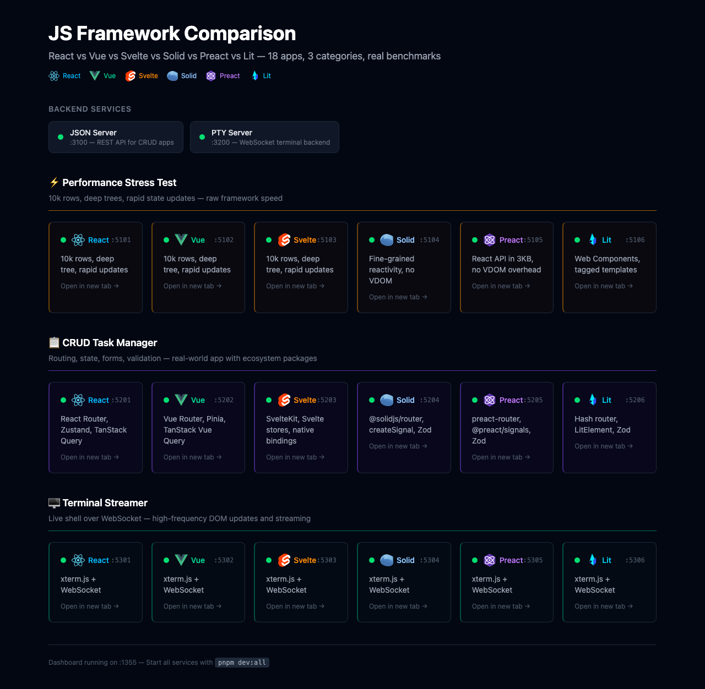

# React vs Vue vs Svelte vs Solid vs Preact vs Lit — Real-World Comparison

Side-by-side comparison of 6 JavaScript frameworks using identical apps. Not synthetic benchmarks or hello worlds — actual apps you'd build at work.



## What's Inside

### 3 App Types × 6 Frameworks = 18 Apps

#### Performance Stress Test
10k row table, deep component tree, rapid state updates — measures raw rendering speed and reactivity.


#### CRUD Task Manager
Full task manager with filters, search, pagination, forms — measures real-world DX and ecosystem maturity.


#### Terminal Streamer
Web terminal connected to a real shell via WebSocket — measures high-frequency DOM updates and lifecycle management.


### Ecosystem Used

| | React | Vue | Svelte | Solid | Preact | Lit |
|---|---|---|---|---|---|---|
| **Routing** | React Router v7 | Vue Router | SvelteKit | @solidjs/router | preact-router | Hash router |
| **State** | Zustand | Pinia | Svelte stores | createSignal | @preact/signals | LitElement @state |
| **Server State** | TanStack Query | TanStack Vue Query | fetch + load | createResource | signals | fetch + @state |
| **Forms** | React Hook Form + Zod | VeeValidate + Zod | Native + Zod | Native + Zod | Native + Zod | Native + Zod |
| **Terminal** | xterm.js | xterm.js | xterm.js | xterm.js | xterm.js | xterm.js |
| **Styling** | Tailwind v4 | Tailwind v4 | Tailwind v4 | Tailwind v4 | Tailwind v4 | Tailwind v4 |

## Benchmark Results

Measured with Playwright headless Chromium. Median of 3 runs. All six apps render the same UI with the same data.

### Rendering Performance (ms, lower is better)

| Benchmark | React | Vue | Svelte | Solid | Preact | Lit |
|---|--:|--:|--:|--:|--:|--:|
| Create 10,000 rows | 820.1 | 265.1 | 467.3 | **223.8** | 673.5 | 356.2 |
| Update every 10th row | 251.3 | 50.0 | **35.9** | 52.9 | 145.2 | 42.8 |
| Swap rows | 190.8 | 44.8 | 42.6 | **26.1** | 120.3 | 38.5 |
| Select row | 248.3 | 28.4 | **15.0** | 216.3 | 152.7 | 22.1 |
| Append 1,000 rows | 207.6 | 68.6 | 94.4 | **44.1** | 135.8 | 72.4 |
| Clear all | 63.3 | 31.2 | 28.1 | **24.1** | 42.5 | 26.8 |

### Bundle Size (JS gzipped)

| App | React | Vue | Svelte | Solid | Preact | Lit |
|---|--:|--:|--:|--:|--:|--:|
| Perf Stress Test | 62.4 KB | 28.1 KB | 18.0 KB | 8.1 KB | 9.2 KB | **7.8 KB** |
| Terminal Streamer | 135.3 KB | 99.6 KB | 87.4 KB | 79.1 KB | 82.3 KB | **76.9 KB** |

### What the numbers say

- **Solid is fastest for bulk operations** — creating 10k rows (224ms), appending 1k (44ms), and clearing (24ms) are all best-in-class.
- **Svelte wins targeted single-element updates** — selecting one row in 15ms. Compiled reactivity tracks exactly which DOM nodes to touch.
- **Lit is the dark horse** — near-Svelte performance on partial updates (swap 38ms, select 22ms) with the smallest bundles (7.8KB). Web Components have minimal framework overhead.
- **Preact is React but faster** — 20-40% faster across the board with a 6.8x smaller bundle. Same API, less cost.
- **Vue is the all-rounder** — competitive everywhere, never the slowest. Template compiler + proxy reactivity is well-optimized.
- **React has the most overhead** — consistently 3-10x slower than the others on partial updates. The VDOM diffing cost scales with list size.

> Numbers will vary by machine. Run `pnpm dev:all` and test yourself.

## Quick Start

```bash
pnpm install
pnpm dev:all
```

Open **http://localhost:1355** — dashboard with links to all 18 apps.

## Running Individual Apps

```bash
# Backends (needed for CRUD and Terminal apps)
pnpm dev:server:json    # REST API on :3100
pnpm dev:server:pty     # WebSocket terminal on :3200

# Performance
pnpm dev:perf:react     # :5101
pnpm dev:perf:vue       # :5102
pnpm dev:perf:svelte    # :5103
pnpm dev:perf:solid     # :5104
pnpm dev:perf:preact    # :5105
pnpm dev:perf:lit       # :5106

# CRUD
pnpm dev:crud:react     # :5201
pnpm dev:crud:vue       # :5202
pnpm dev:crud:svelte    # :5203
pnpm dev:crud:solid     # :5204
pnpm dev:crud:preact    # :5205
pnpm dev:crud:lit       # :5206

# Terminal
pnpm dev:xterm:react    # :5301
pnpm dev:xterm:vue      # :5302
pnpm dev:xterm:svelte   # :5303
pnpm dev:xterm:solid    # :5304
pnpm dev:xterm:preact   # :5305
pnpm dev:xterm:lit      # :5306
```

## Adding a New Framework

```bash
pnpm add-framework <name>
```

Generates all 3 apps with correct ports and TODO placeholders. See [CONTRIBUTING.md](CONTRIBUTING.md) for the full guide.

## Running Benchmarks

```bash
pnpm bench                                          # all benchmarks
pnpm bench -- --app perf-stress --framework react   # specific app/framework
pnpm bench -- --runs 10                             # more iterations
```

Results are written to `results/comparison.md`.

## Running Tests

```bash
pnpm e2e        # 61 Playwright E2E tests across all apps
```

## Project Structure

```
├── dashboard/           # Index page on :1355
├── apps/
│   ├── perf-stress/     # react/ vue/ svelte/ solid/ preact/ lit/
│   ├── crud/            # react/ vue/ svelte/ solid/ preact/ lit/
│   └── xterm/           # react/ vue/ svelte/ solid/ preact/ lit/
├── server/
│   ├── json/            # json-server for CRUD apps
│   └── pty/             # node-pty + WebSocket for terminal apps
├── bench/               # Playwright-based benchmark runner
├── shared/              # Types, benchmark utilities
└── e2e/                 # E2E smoke tests
```

## Tech Stack

- **Build**: Vite 6, pnpm workspaces
- **React** 19, **Vue** 3.5, **Svelte** 5 (runes), **Solid** 1.9, **Preact** 10, **Lit** 3
- **Tailwind CSS** v4
- **TypeScript** throughout
- **Playwright** for benchmarks and E2E tests

## License

MIT
